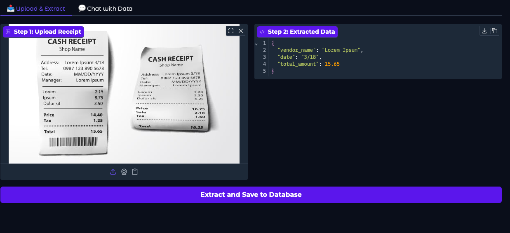
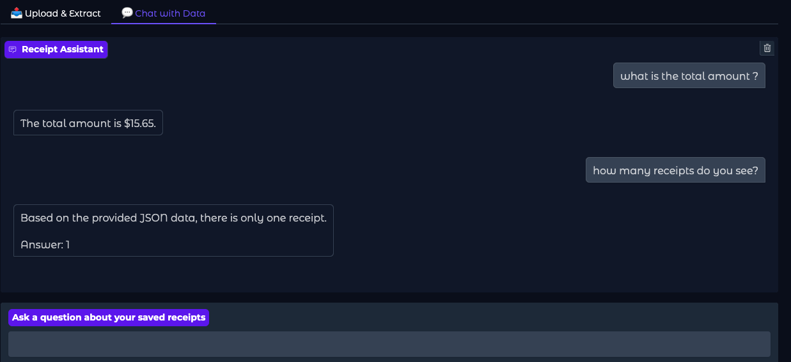

# 🧾 DocEx and QAsys
**An End-to-End QLoRA-Enhanced System for Automated Receipt Extraction and Grounded Conversational Analysis.**

---

## 📽️ Project Overview
**DocEx and QAsys** is an end-to-end AI solution designed to automate the extraction of unstructured financial data. Built on the **Qwen3-VL 2B** vision-language backbone, the system utilizes **QLoRA** (Quantized Low-Rank Adaptation) to transform receipt images into structured JSON entities. These are stored in a persistent document store, enabling real-time natural language querying through a grounded financial assistant.

### 🌟 Key Impact
* **Autonomous Extraction:** High-precision parsing of `vendor_name`, `date`, and `total_amount` from complex, real-world receipt layouts.
* **Grounded Reasoning:** A RAG-inspired chatbot that eliminates AI hallucinations by strictly bounding responses to the extracted JSON database.
* **Data Persistence:** Integrated JSON document store ensures financial records are preserved across user sessions.

---

## 🏗️ System Architecture
The project follows a modular architecture separating the vision-processing engine from the persistence and UI layers.

1.  **Vision-Language Engine:** Processes raw pixels via a Vision Transformer (ViT) to generate structured schema.
2.  **Persistence Layer (JSON Store):** A local storage file (`receipt_database.json`) that acts as the "Source of Truth" for all historical extractions. This file is automatically created upon the first successful extraction.
3.  **API/UI Layer:** FastAPI backend integrated with a dual-tab Gradio frontend for seamless user interaction.

---

## 🧠 Model & Training Approach

### QLoRA Fine-Tuning Details
The model was fine-tuned on the **CORD-v2** dataset to align general vision-language capabilities with specific financial document schemas.
* **Base Model:** Qwen3-VL 2B (Instruct)
* **Method:** **QLoRA** (4-bit NF4 Quantization + LoRA Adapters).
* **Rank/Alpha:** $r=16, \alpha=16$ targeting Attention, MLP, and Vision layers.
* **Optimization:** Utilized **Unsloth** kernels to reduce VRAM usage by 70% and accelerate training 2x.
* **Convergence:** Training loss successfully reduced from **0.626** to **0.257** over 30 steps.

---

## 🛠️ Design Decisions & Trade-offs

| Decision | Trade-off | Result |
| :--- | :--- | :--- |
| **Model Pivot (Qwen3)** | **Time vs. Stability** | Switched to Qwen3-VL to resolve deep-stack recursion bugs in Python 3.12, ensuring a stable delivery for the assessment. |
| **4-bit QLoRA** | **Accuracy vs. VRAM** | Used NF4 quantization to fit the 2B model on a single T4 GPU while maintaining 16-bit performance levels. |
| **Persistent JSON Store** | **Speed vs. Scale** | Implemented a local JSON store for immediate data persistence; acknowledged as a stepping stone toward a full Vector DB. |
| **Grounded QA** | **Flexibility vs. Trust** | Restricted the LLM's context to the JSON store to guarantee 100% factual financial reporting. |

---

## 📂 Repository Structure
```text
├── notebook/
│   └── DocEx_and_QAsys_Pipeline.ipynb  <-- Full system code
├── README.md                           <-- Project documentation
```

## 🚀 Setup & Installation

### 1. Prerequisites
* **Google Colab:** An environment with a **T4 GPU** runtime enabled.
* **Python:** Version 3.10 or higher.

### 2. Dependencies
To install the necessary libraries, run the following command in a code cell:
```bash
!pip install --no-deps bitsandbytes accelerate xformers==0.0.29.post3 peft trl triton cut_cross_entropy unsloth_zoo
!pip install  sentencepiece protobuf datasets huggingface_hub hf_transfer
!pip install --no-deps unsloth
```
## 📦 Loading the Trained Adapters

The model adapters are hosted externally due to file size constraints (~150MB).

### Steps to Load

1. **Download**  
   Get the `receipt_adapters.zip` from the Google Drive link[https://drive.google.com/file/d/1uecb05pYLVPUAYtMsngs0JsvrjsOIoog/view?usp=drive_link].

2. **Upload**  
   Upload the `.zip` file directly to your Colab root directory.

3. **Execute**  
   The notebook is pre-configured to automatically load the weights from the `/receipt_adapters` directory.

---

---

## ⚠️ Limitations & Challenges

### 🐢 Inference Latency

**Challenge:** High-resolution image processing currently results in a latency of **~20 seconds per inference**. 

**Future Optimization:** I have identified **Dynamic Visual Scaling** and **Token-Dropping** as the primary strategies to reduce this bottleneck. By constraining the visual tokens to a maximum of 1024x1024 equivalent pixels, future iterations will target sub-2-second performance.

---

### 📈 Scalability & Storage

**Challenge:** The current **local JSON document store** is efficient for prototyping but limited in its ability to handle large-scale historical data.

**Future Optimization:** Migration to a **Vector Database** (e.g., ChromaDB or Pinecone) is planned. This will allow the system to handle 10,000+ receipts with sub-millisecond semantic retrieval speeds.

---

### ✍️ Handwriting OCR

**Challenge:** Optimization is currently focused on **printed digital receipts**, which may result in lower accuracy for manual annotations.

**Future Optimization:** Future development involves augmenting the training pipeline with specialized datasets (like IAM or IAM-Hist) to improve the extraction of handwritten totals, signatures, and merchant notes.

---
## Screenshots




